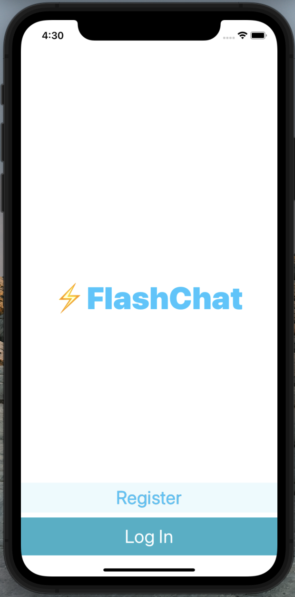
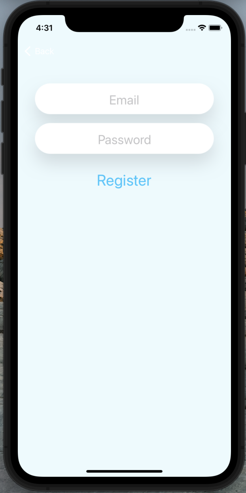
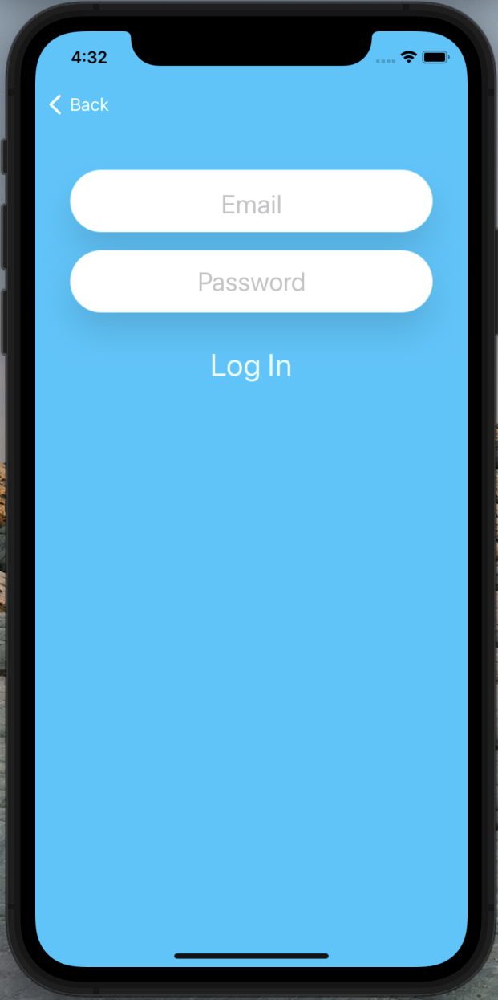
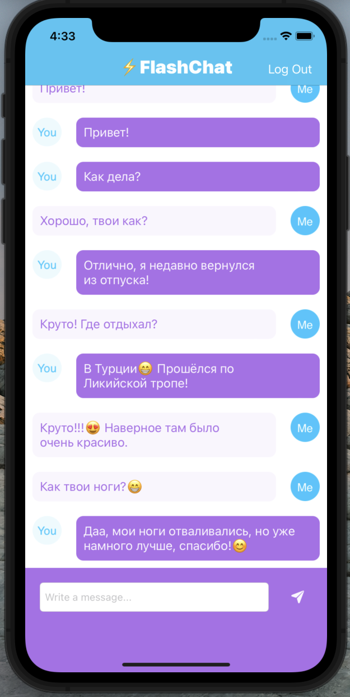

# Flash-Chat

## Описание:
* Учебное приложение-мессенжер по курсу iOS & Swift - The Complete iOS App Development Bootcamp на Udemy от Dr. Angela Yu

## Реализовано с:
* Приложение написано с использованием Storyboard и .xib
* MVC - архитектурный паттерн
* FireBase Cloud Firestore - база данных для авторизации и хранения сообщений 
* UITableView - реализация сообщений чата
* CocoaPods - как менеджер зависимостей 

## Что сделано:
* Главный экран
* Экран для регистрации нового пользователя
* Экран для входа существуещего пользователя
* Экран с чатом

   
